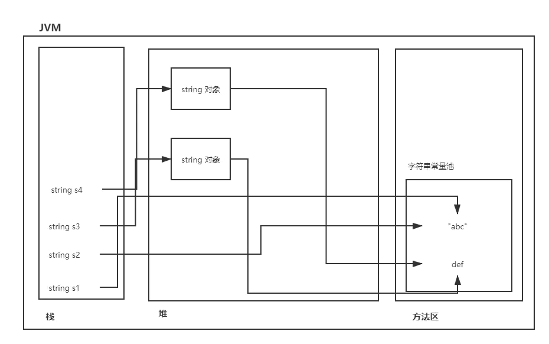

## Object类

#### toSting

```java
public String toString() {
        return getClass().getName() + "@" + Integer.toHexString(hashCode());
    }
```

默认实现：类名+“@”+对象的内存地址

作用：通过调用方法将java对象转换成字符串表示形式

建议所有子类重写此方法

#### equals

```java
public boolean equals(Object obj) {
        return (this == obj);
    }
```

用于判断两个java对象是否相等

“==”用于对象判断的是内存地址是否相等，判断两个对象内容是否相同需要重写equals方法

*java中基本数据类型判断相等使用“==”，引用数据类型使用equals*

#### finalize

```java
protected void finalize() throws Throwable { }
}
```

这个方法不需要程序员手动调用，JVM的垃圾回收器负责调用

当一个java对象即将被垃圾回收的时候，垃圾回收器负责调用

如果希望在对象销毁时机执行一段代码，可写入finalize

*如静态代码块是类加载的时机*

java中的立即回收器垃圾太少，时间未到等条件下有可能启动也可能不启动

```java
System.gc();  		//建议启动垃圾回收器
```

#### hashCode

```java
public native int hashCode();
```

带有native关键字，底层调用C++程序

hashCode()返回对象的哈希值，实际上是内存地址经过哈希算法得出的


## String类

#### 概述

String表示字符串类型，是引用数据类型

在java中随便使用“ ”括起来的都是String对象

java中规定，双引号括起来的字符串是不可变的，都是直接存储在方法区的"字符串常量池"中

**String对象存储原理**

```java
public class Demo{
    public static void main(String[] args){
        String s1 = "abc";
        String s2 = "abc";
        String s3 = new String("def");
        String s4 = new String("def");
    }
}
```



#### 构造方法

```java
String s1 = "hello world";							//创建字符串对象最常用方式
String s2 = new String("hello world");

byte[] bytes = {97,98,99};							//a,b,c
String s3 = new String(bytes);						//使用byte数组创建
String s4 = new String(bytes,offset,length);		//(字节数组，数组下标起始位置，长度)

char[] chars = {'你','好','世','界'};
String s5 = new String(bytes);						//使用char数组创建
String s6 = new String(bytes,offset,length);		//(char数组，数组下标起始位置，长度)
```

#### 常用方法

**charAt**

```java
//返回指定位置字符
char c = "你好世界".charAt(1);	//好
```

 **compareTo**

```java
//按照字典序比较两个字符串，前小后大返回负数
int result = "abc".compareTo("abc");	//0
```

**contains**

```java
//判断前面字符串是否包含后面字符串，返回boolean
System.out.print("hello world".contains("world"));	//True
```

**endsWith , startsWith**

```java
//判断当前字符串是否以某个字符串结尾或开始，返回boolean
System.out.print("hello world".endsWith("world"));		//True
System.out.print("hello world".startsWith("hello"));	//True
```

**equalsIgnoreCase**

```java
//判断两个字符串是否相等，忽略大小写，返回boolean
System.out.print("ABC".equalsIgnoreCase("abc"));	//True
```

**getBytes**

```java
//将字符串对象转换为字节数组
byte[] bytes = "abcdef".getBytes();
```

**indexOf**

```java
//判断某个子字符串在当前字符串中第一次出现处的索引
int index = "c++ java python".indexOf("java");		//4
//判断某个子字符串在当前字符串中最后一次出现处的索引
int index = "c++ java java".indexOf("java");		//9
```

**isEmpty**

```java
//判断某个字符串是否为空字符串
if(str.isEmpty())
...
```

**length**

```java
//获得字符串长度
int length = str.length();
```

**replace**

```java
//将字符串中的旧子串替换为新子串
String newString = "http://www.baidu.com".replace("http://","https://");
```

**split**

```java
//将字符串以给定的正则表达式切分
String[] ymd = "1980-10-11".split("-");
```

**subString**

```java
//截取子字符串
String sub = "http://www.baidu.com".subString(7);		//www.baidu.com
String sub = "http://www.baidu.com".subString(7,10);	//www
```

**toCharArray**

```java
//将字符串转化为char数组
char[] chars = "你好世界".toCharArray();
```

**toLowerCase , toUpperCase**

```java
//将字符串转化为小写（大写）
String lower = "ABCabc".toLowerCase();		//abcabc
String upper = "ABCabc".toUpperCase();		//ABCABC
```

**trim**

```java
//去除字符串前后空白
String str = "    123   ".trim();	//"123"
```

**valueOf**

```java
//将非字符串转化为字符串（static方法）
//当参数为对象时会自动调用toString方法
String s1 = String.valueOf(1000);		//"1000"
```


## StringBuffer

Java中的字符串是不可变的，每一次拼接都会产生新字符串，大量占用方法区内存造成内存空间的浪费

如果以后需要进行大量字符串拼接操作，推荐使用JDK中自带的java.lang.StringBuffer和java.lang.StringBuilder


StringBuffer底层实际上是一个byte数组，初始化容量为16

拼接字符串统一调用append方法，若byte数组已满会自动扩容（实现方式很像C++中的容器）

*在创建StringBuffer的时候尽可能预估初始容量*

```java
public class Demo{
    public static void main(String[] args){
        StringBuffer buffer = new StringBuffer();		//创建
        buffer.append("abc");
        buffer.append(3.14);			//拼接
        System.out.println(buffer.toString());		//"abc3.14"
    }
}
```


使用**StringBuilder**也可以进行字符串拼接，和buffer的区别在于，StringBuffer中的方法都有synchronized修饰，在多线程环境下是安全的，而Builder没有

```java
public class Demo{
    public static void main(String[] args){
        StringBuilder builder = new StringBuffer();		//创建
        builder.append("abc");
        builder.append(3.14);			//拼接
        System.out.println(builder.toString());		//"abc3.14"
    }
}
```


## 包装类

#### 八种包装类

Java中为八种基本数据类型准备了对应的八种包装类型，八种包装类属于引用数据类型，父类是Object

当方法的参数为对象，但需要接收一个基本数据类型时，可以传包装类：

*下面的学习以Integer为例，其它类型依葫芦画瓢*

| 基本数据类型 | 包装类              |
| ------------ | ------------------- |
| byte         | java.lang.Byte      |
| short        | java.lang.Short     |
| int          | java.lang.Integer   |
| long         | java.lang.Long      |
| float        | java.lang.Float     |
| double       | java.lang.Double    |
| boolean      | java.lang.Boolean   |
| char         | java.lang.Character |

#### 装箱与拆箱

```java
//基本数据类型--->引用数据类型
//引用数据类型--->基本数据类型
public class Demo{
    public static void main(String[] args){
        Integer i = new Integer(123);		//装箱
        float f = i.floatValue();			//拆箱  123.0
        Integer x = 100;					//自动装箱
        int y = x;							//自动拆箱
        System.out.print(x+1);				//可以，x被转化为基本数据类型
    }
}

```

注意：

```java
public class Demo{
    public static void main(String[] args){
        Integer a = 128;
        Integer b = 128;
        System.out.print(a==b);		//false
        Integer a = 127;
        Integer b = 127;
        System.out.print(a==b);		//True	
        //java为提高程序执行效率，将[-128，127]之间所有包装对象提前创建好了放入常量池中
    }
}
```


#### Integer常用方法

```java
//构造方法：
Integer i = new Integer(123);		//123
Integer i = new Integer("123");		//123
//double同理
Double i = new Double(3.14);		//3.14
Double i = new Double("3.14");		//3.14

//数据类型最大值和最小值
Integer.MAX_VALUE;
Integer.MIN_VALUE;

int retValue = Integer.parserInt("123");			//将字符串转化为int，用于保存输入

String binary = Integer.toBinaryString(3);			//转化为二进制字符串
String octal = Integer.toOctalString(8);			//转化为十六进制字符串
String hex = Integer.toHexString(16);				//转化为十六进制字符串

Integer a = Integer.valueOf("100");					//static方法，string-->Integer
```
## 日期类

#### 时间戳

可用于统计时长

```java
//获取紫1970-01-01 00:00:00 至当前系统时间的总毫秒数
long timeMillis = System.currentTimeMillis();
```

#### 构造日期

java中使用日期类需要导入java.util.Date

```java
Date nowTime1 = new Date();					//获取系统当前时间，精确到毫秒
Date nowTime2 = new Date(System.currentTimeMillis());	//通过时间戳构造
System.out.println(nowTime1);				//toString方法已经被重写，直接输出日期字符串
```

#### 日期格式化

在java.text.SimpleDateFormat包中有专门负责日期格式化的工具

```java
Date nowTime = new Date();		//获取系统当前时间，精确到毫秒
SimpleDateFormat sdf = new SimpleDateFormat("yyyy-MM-dd HH:mm:ss SSS");
/*
yyyy 年
MM 月
dd 日
HH 时
mm 分
ss 秒
SSS 毫秒
*/
sdf.format(nowTime);			//返回符合我们期望格式的字符串

//表示日期的字符串转化为Date对象
String time = "2008-08-08 08:08:08 888";
Date time2 = sdf.parse(time);
```


## 数字类

#### 数字格式化

在java.text.DecimalFormat包中有专门负责数字格式化的工具

```java
DecimalFormat df = new DecimalFormat("###,###.##");
String s = df.format(1234.561);	//"1,234.56"
/*
# 代表任意数字
, 代表千分位
. 代表小数点
0 代表不够时补0
*/
```

#### 大数类

在java.math.BigDecimal包中有专门负责处理高精度数字的工具

```java
BigDecimal v1 = new BigDecimal(100);
BigDecimal v2 = new BigDecimal("12345678987654321");
BigDecimal v3 = v1.add(v2).devide(v1);
```

#### 随机数

在java.util.Random包中有专门负责处理高精度数字的工具

```java
Random random = new Random();
int num1 = random.nextInt();		//随机产生一个int随机数
int num2 = random.nextInt(101)		//随机产生一个[0,100]的随机数
```


