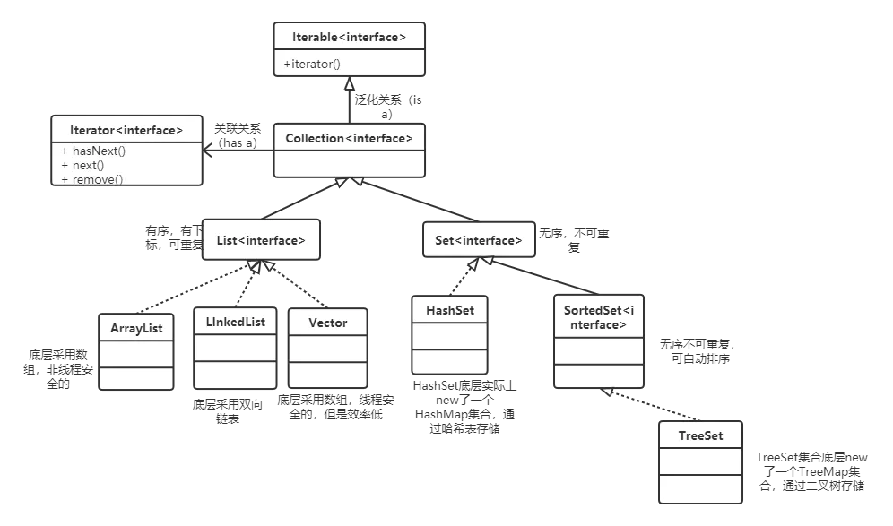
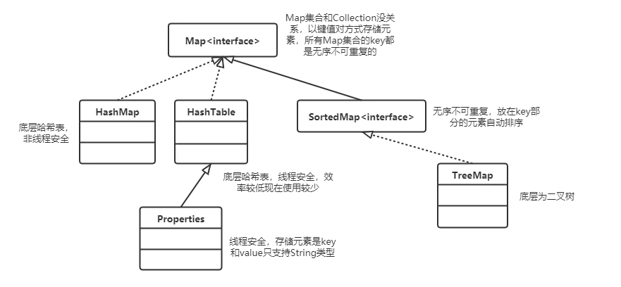

***本章对比C++中的STL学习，并多翻文档***

## 集合

#### 集合概述

- 集合实际上就是一个容器，可以来容纳其它类型的数据

- 集合不能直接存储基本数据类型或者java对象，集合中存储的是引用

- java中每个不同的集合底层会对应不同的数据结构

- java中集合分为两大类，以单个方式存储元素这类集合的超级父接口是Collection，以键值对方式存储元素这类集合超级父接口是Map


*所有集合类和集合接口都在java.util.***包下*


#### 集合继承结构图







## Collection

 Collection的作用就是规定了一个集合有哪些基本的操作

#### Collection常用方法

```java
Collection c = new ArrayList();		//Collection为接口，不能直接创建
c.add(100);							//自动装箱，返回boolean
c.add(new Object);					
int size = c.size();				//返回集合元素个数
c.isEmpty();						//判断集合是否为空  boolean
c.contains(100);					//判断集合中是否包含某元素	boolean
c.remove(100);						//删除集合中某个元素 返回boolean
c.clear();							//清空集合
Object[] objs = c.toArray();		//将集合转化为对象数组
```

**contains()深入：**

```java
Collection c = new ArrayList();		//Collection为接口，不能直接创建
String s1 = new String("abc");
String s2 = new String("abc");
c.add(s1);
c.contains(s2);						//true
```

- contains()方法底层调用的是equals方法，String类重写了equals方法，所以比较的是内容，而不是内存地址

- Collection中存储的对象必须重写equals方法


**remove()深入：**

```java
Collection c = new ArrayList();		//Collection为接口，不能直接创建
String s1 = new String("abc");
String s2 = new String("abc");
c.add(s1);
c.remove(s2);
c.isEmpty();						//True
```

remove()方法中使用equals方法比较两个对象并删除


#### Collection 工具类

```java
Collection c = new ArrayList();		//Collection为接口，不能直接创建
c.add(100);
//....
Collections.sort(c);					//排序，要求元素类型实现Comparable接口
Collections.sort(list,Comparator);				//排序，调用Comparator
```


#### 迭代器

- 以下迭代方式只适用于Collection，在Map中不适用

- 迭代器初始位置为集合中第一个元素的前面

- 集合结构只要发生改变，迭代器必须重新获取，否则会出现异常

- 获取迭代器遍历集合，相当于对当前集合状态拍了一个快照，迭代器参照快照进行迭代


```java
Collection c = new ArrayList();		//Collection为接口，不能直接创建
c.add(1);
c.add(2);
c.add(3);
Iterator it = c.iterator();			//返回集合的一个迭代器对象
while(it.hasNext()){				//判断当前迭代器下一个位置是否有对象
    Object obj = it.next();			//迭代器指向下一个位置并返回对象
    								//注意没有C++中的it++或it=it->next
    it.remove();					//删除迭代器指向的当前元素
}
```


## List接口

- List接口为Collection的子接口

- List集合存储有序可重复（有下标）


#### 常用方法

```java
List list = new ArrayList();			//创建List类型的集合

//添加元素
list.add(1);
list.add(2);
list.add(3);
list.add(0,4);							//(index,element)

//迭代
Iterator it = list.iterator();
while(it.hasNext()){
    Object obj = it.next();
}

Object obj = list.get(index);			//根据下标获得元素
int first = list.indexOf(3);			//返回特定元素第一次出现的下标
list.set(index,7);						//修改指定位置的元素
list.remove(index);						//删除指定位置的元素
```

## ArrayList

#### 容量与扩容

ArrayList 底层是Object类型的数组，初始化容量为10

```java
List list1 = new Arraylist();		//默认初始化容量10
List list2 = new Arraylist(20);		//初始化容量20
list1.size();						//0
```

扩容时容量增长为原来的1.5倍，建议给定一个预估计的初始化容量，减少数组扩容次数

#### 构造方法

```java
List list1 = new Arraylist();				
List list2 = new Arraylist(capacity);
List list3 = new Arraylist(collection);		//可用于集合间的转换
```


## LinkedList

底层实现为双向链表，所以根据顺序表与链表的优缺点选择合适的数据结构

```java
List list = new LinkedList();
list.add("A");
list.add("B");
list.add("C");
for(int i = 0;i<list.size();i++){
    Object obj = list.get(i);
}
```

## Vector

- 底层为数组，初始化容量为10

- 扩容时容量增长为原来的两倍（同C++中的vector）

- vector中所有方法都是线程同步的，效率比较低，使用较少


```java
//基本代码参考List接口
Collections.synchronizedList(myList);		//可将线程不安全的list转化为线程安全的
```


## 泛型机制

#### 泛型使用

- 用泛型来指定集合中的数据类型，这样之后集合中数据类型可以统一，从集合中取出的类型是规定的类型，不需要进行大量类型转换

- 泛型是只在编译阶段起作用，在程序运行阶段没用


```java
List<String> list = new ArrayList<String>();		//创建只能存储String类的ArrayList
list,add("abc");
list.add("def");
//list.add(100);			//报错
Iterator<String> it = list.iterator();		//创建指定类型迭代器
while(it.hasNext()){
    String str = it.next();					//否则只能使用Object接受
    System.out.println(str);
}
```

#### 自动类型推断机制（钻石表达式）

*个人认为就是少打几个字*

```java
List<String> list = new ArrayList<>();
list.add("abc");
list.add("def");
Iterator<String> it = list.iterator();		//创建指定类型迭代器
while(it.hasNext()){
    String str = it.next();					//否则只能使用Object接受
    System.out.println(str);
}
```

#### 自定义泛型

也就是C++中的类模板

```java
public class MyTemplate<dataType> {
    public void doSome(dataType data){
        System.out.println(data);
    }
}

public static void main(String[] args){
    MyTemplate<String> mt = new MyTemplate<>();
    mt.doSome("abc");
}
```


## HashSet和TreeSet

HashSet用法可当作C++STL中的unordered_set

TreeSet用法可当作C++STL中的set


#### 自定义类型排序

类需要实现java.lang.Comparable接口才能在set中被自动排序

**方法一：实现Comparable接口**

```java
//实例,客户先按年龄再按姓名大小存入set:
class Customer implements Comparable<Customer>{		//实现接口
    private int age;
    private String name;
    
    public int compareTO(Customer c){				//比较函数，根据返回的正负排序
        if(this.age == c.age){
            return this.name.compareTo(c.name);		//String类已经实现compareTo
        }
        else{ 
        	return this.age-c.age;
        }
    }
}
```

**方法二：使用比较器**

```java
class Customer {		
    private int age;
    private String name;
}

class CustomerComparator implements Comparator<Customer>{
    public int compare(Customer c1, Customer c2){
        //指定比较规则
        if(this.age == c.age){
            return this.name.compareTo(c.name);
        }
        else{ 
        	return this.age-c.age;
        }
    }
}

public class Test{
    public static void main(String[] args){
        Treeset<Customer> customers = new Treeset<>(new CustomerComparator());
       	//创建Treeset时需要传递一个比较器进去
    }
}
```

**方法三：使用匿名内部类**

```java
public class Test{
    public static void main(String[] args){
        Treeset<Customer> customers = new Treeset<>(new CustomerComparator(){
        if(this.age == c.age){
            return this.name.compareTo(c.name);
        }
        else{ 
        	return this.age-c.age;
        }
        });
       	//new Comparator时写比较规则
    }
}
```


## Map

Map集合以键值对存储数据，key和value都是引用数据类型

Map与Collection没有继承关系

#### Map常用方法

```java
Map<Key,Value> map = new HashMap<>();			//创建map对象
map.put(key1,value1);							//向map中添加键值对
map.put(key2,value2);
map.size();										//获取键值对数量
Collection<Value> values =  map.values()		//将所有值提取放入集合
map.remove(key1);								//删除某个key对应的键值对
Value value = map.get(key2);					//获取某个关键字对应的值
map,contains(value2);							//判断是否包含某个value，底层调用equals
map.isEmpty();									//判断是否为空
```

#### Map集合的遍历

```java
//先提取所有的key，使用迭代器遍历key
Set<Key> keys = map.keySet();
Iterator<Key> it = keys.iterator();
while(it.hasNext()){
    Key key = it.next();
}

//foreach
Set<Key> keys = map.keySet();
for(Key key : keys){
   ... 
}

//使用map集合中entrySet()方法
Set<Map.Entry<Key,Value>> set = map.entrySet();
for(Map.Entry<Key,Value> node : set){
    System.out.println(node.getKey()+"--->"+node.getValue());
}
```

entrySet()可理解为将键值对转化为一个对象(Map.Entry)


## HashMap

- HashMap底层为散列表，使用拉链法处理冲突

- HashMap初始容量为16（官方推荐为2的次方，可以使散列更均匀），当装填因子达到0.75时开始扩容

- Hashmap可以允许key和value为null，而HashTable不允许

- JDK8中，当拉链中一个链表元素个数超过8时，自动转化为红黑树存储，当红黑树元素个数小于6之后自动恢复单向链表

- HashMap在比较元素时先调用HashCode方法确定元素位置，随后在单向链表中（大于一个元素）使用equals方法比较元素，所以类中当equals方法可以判断两个类相同时，需要重写HashCode方法使两个类HashCode方法返回结果相同


*使用Alt+insert**同时**重写HashCode和equals方法*


```java
Map<Integer,String> map = new HashMap<>();
map.put(1,"zhangsan");
map.put(2,"lisi");
map.put(3,"wangwu");
map.put(3,"zhaoliu");		//当key相同时value覆盖
```


## properties

properties是属性类，继承HashTable，它的key和value都是String类

```java
Properties p = new Properties();
p.setProperty("username","zhangsan");			//存属性
p.setproperty("password","123");
String username = p.getProperty("username");		//取属性
```

