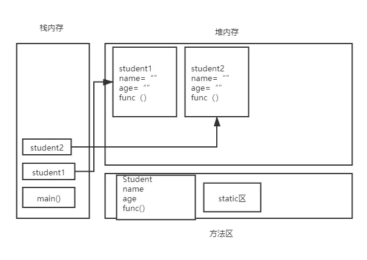

## 写在开篇

自己想记点笔记证明自己学过，主要是给自己看（如果会看），和C++相似的部分就不再赘述。欢迎大佬交流

*初次使用markdown语法，希望以后能越来越美观QAQ*


## 基础语法

因为Java和C++很像，所以这一部分略过，学习过程中参考C++语法，注意相区别的地方就好


## 面向对象

### 类和对象的创建

- **new关键字**

  使用new关键字创建对象的时候，除了分配内存空间外，还会给创建好的对象进行默认初始化以及对类中构造器（可理解为C++中的构造函数）的调用

  

- **构造器**
  - 一个类的构造器必须和类的名字相同，必须没有返回类型也不能写void
  - 使用new关键字必须要有构造器，其本质是在调用构造器
  - 不显式定义时系统会自动生成一个默认构造器，一旦定义了有参构造器，无参构造就必须显式定义

```java
public class Student{
    String name;
    
    public Student(){					//无参构造
        this.name = "defult";
    }
    
    public Student(String name){		//有参构造
        this.name = name;
    }
}

public class Demo{
    public static void main(String[] args){
       Student student = new student("Mario");
    }
}
```


- **java对象内存情况**

  

  对象的名字可以理解为对象的一个引用，指向堆内存中对象存在的地址


### static修饰符

```java
public class Person{
    {
        System.out.println("匿名代码块");
    }
    
    static{
        System.out.println("静态代码块");
    }
    
    public Person(){
        System.out.println("构造函数调用");
    }
}

public class Demo{
    public static void main(String[] args){
        Person p1 = new Person();
        System.out.println("=======");
        Person p1 = new Person();
    }
}

/*
out:
静态代码块
匿名代码块
构造函数调用
=======
匿名代码块
构造函数调用
*/
```

静态代码块只加载一次

```java
public class Student{
    private static int age;		//静态成员变量
    private double score;		//非静态成员变量
    
    public void run(){}
    public static void go(){}
}

public class Demo{
    public static void main(String[] args){
        Student s = new Student();
        System.out.println(Student.age);
        System.out.println(Student.score);		//不允许
        System.out.println(s.age);				//允许
        System.out.println(s.score);
        
        s.run();
        s.go();			//允许
        run();			//不允许
        go();
    }
}
```

静态成员变量和方法使用static修饰，static是和类一起加载的，在类实例化之前就存在；而非静态方法在类实例化之后才存在。


### 封装

将对象的属性设置为私有，使用get、set方法访问可以实现封装（同C++，注意如何设置私有）

*alt+insert可以自动生成get、set方法*

```java
public class Student{
    //对象的属性设置为私有
    private String name;		
    private int id;
    
    public Student(){
        this.name = "defult";
        this.id = 1;
    }
    
    public String getName(){
        return this.name;
    }
    
    public void setName(String name){
        this.name = name;
    }
}

public class Demo{
    public static void main(String[] args){
       Student student = new student();
       student.name = "zhangsan";				//不可以
       student.setName("zhangsan")				//可以
       String stuname = student.getName();		//可以
    }
}
```


### 继承

```java
public class Father{
    protected String name = "zhangsan";
    
    public void func1(){
        return;
    }
}

public class Son extends Father{
    private String name = "lisi";
    
    public Son(){
        super();		//调用父类的构造器必须在子类构造器第一行（不写默认调用）
        
    }
    public void test(){			
        System.out.println(this.name);		//输出 lisi
        System.out.println(super.name);		//输出 zhangsan
    }
}

public class Demo{
    public static void main(String[] args){
       Son s = new Son();
        //子类继承了父类，就会有父类全部public、protect方法和属性
        s.func1();
        s.name = "zhangsan";
    }
}
```

Java中只有单继承，没有多继承（一个儿子只能有一个爹，一个爹可以有多个儿子）

- **super**

  super代表父类对象的引用（用法类似this）

  super 不能调用父类私有的属性方法

  super 只能出现在子类的方法中

  super 和 this 不能同时调用构造方法

  

- **object类**

  Java中所有的类都默认直接或者间接继承object类

  *ctrl+H可以打开继承树*

  

- **方法重写**

  父类的功能，子类不满足或者不一定需要时，需要重写

  ```java
  public class B{
      public void test(){
          System.out.print("testB")
      }
      
      public static void stest(){
          System.out.print("stestB")
      }
  }
  
  public class A extends B{
      public void test(){						//方法重写
          System.out.print("testA")
      }
      
      public static void stest(){
          System.out.print("stestA")
      }
  }
  
  public class Demo{
      public static void main(String[] args){
          A a = new A();
          a.test();			//testA
          a.stest();			//stestA
          
          B b = new A();		//父类的引用指向了子类
          b.test();			//testA
          b.stest();			//stestB
      }
  }
  ```

  - 重写需要有继承关系，子类重写父类的方法，方法名和参数列表必须相同（区别于重载）
  - 修饰符范围可以扩大不能缩小（public>protected>default>private）
  - 父类的引用可以指向子类
  - 注意方法中是否加static修饰符是有区别的


### 多态

```java
public class Father{
    public void run(){
        System.out.println("father run");
    }
}

public class Son extends Father{
    public void run(){
        System.out.println("son run");
    }
    
    public void eat(){
        System.out.println("son eat");
    }
}

public class Demo{
    public static void main(String[] args){
        Son s1 = new Son();
        Father s2= new Son();
        s1.run();			//son run
        s2.run();			//son run
        s1.eat();			//son eat
        s2.eat();			//不能调用
        ((Son) s2).eat();	//son eat
    }
}
```

- **多态注意事项**

  一个对象的实际类型是确定的，但可以指向对象的引用类型有很多

  父类可以指向子类，但不能调用子类独有的方法，除非进行类型转换

  对象能执行那些方法，主要看对象左边的类型，和右边关系不大

  static方法属于类，不属于实例，final无法重写，private方法也无法重写

  

- **instanceof**

  使用instanceof可以判断类间关系

  x instance of y 能不能编译通过，取决于x，y之间是否有父子关系

  ```java
  //Object->String
  //		->Person->Student
  //		->Person->Teacher
  
  Person person = new Student();
  System.out.println(person instanceof Student);	//True
  System.out.println(person instanceof Person);	//True
  System.out.println(person instanceof Object);	//True
  System.out.println(person instanceof Teacher);	//False
  System.out.println(person instanceof String);	//编译出错
  ```


- **类型转换**

  子类转换为父类可能会丢失自己本来的一些方法

  父类转换为子类可用强制类型转换

  ```java
  Father father = son;				//不用强制
  Son son = ((Son)father);			//强制
  ```

  

### 抽象类

抽象方法，只有方法名字，没有方法实现

抽象类的所有方法必须要由子类实现，除非子类也是抽象类

不能new抽象类，只能靠子类去实现

抽象类中可以写普通方法，抽象方法只能出现在抽象类中

抽象类可以有构造器，可从子类中使用super调用

```java
public abstract class Action{
    public abstract void doSomething();
}

public class Eat extends Action{
    public void doSomething(){
        System.out.println("Eat");
    }
}
```


### 接口

接口就是规范，定义一组规则，无法自己写方法

接口中的所有定义都是抽象的，默认是public abstract

一个类可以通过implements实现接口，实现了接口的类就需要重写接口中的方法

接口里面定义的属性默认是public static final的

```java
public interface UserSevice{
    int AGE = 99;   //public static final int AGE = 99;
    
    void add(String name);	//public abstract void add(String name);
    void delete(String name);
    void modify(String name);
    void search(String name);
}

public class UserServiceImpl implements UserService{
    public void add(string name){...}		//重写
    public void delete(string name){...}
    public void modify(string name){...}
    public void search(string name){...}
}
```


### 内部类

内部类就是在一个类的内部再定义一个类

```java
public class Outer{
    private int id = 10;
    public void out(){
        System.out.println("这是外部类的方法")
    }
    
    public class Inner{
        public void in(){
            System.out.println("这是内部类的方法")
        }
    }
}

public class Demo{
    public static void main(String[] args){
        Outer outer = new Outer();
        Outer.Inner inner = Outer.new Inner();
        inner.in();		//out:这是内部类的方法
        int id = inner.id;		//允许
        inner.out();	//out:这是外部类的方法
    }
}
```

