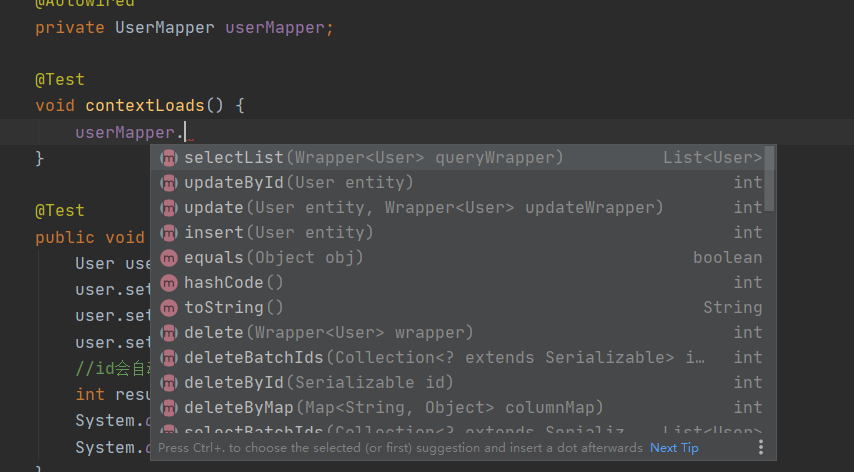
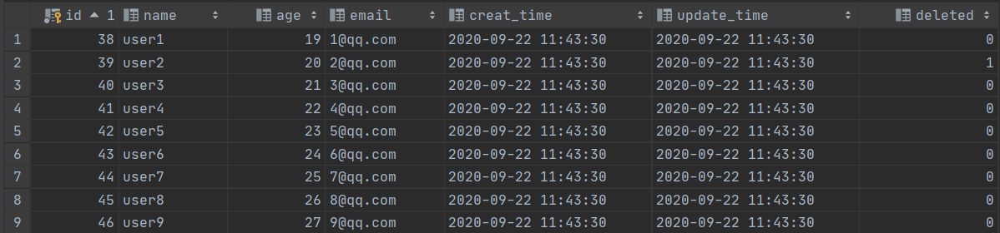

# MybatisPlus

官方文档：https://baomidou.com/

### HelloWorld

---

**1、创建一个数据表用来测试**

```sql
CREATE TABLE user
(
	id BIGINT(20) NOT NULL COMMENT '主键ID',
	name VARCHAR(30) NULL DEFAULT NULL COMMENT '姓名',
	age INT(11) NULL DEFAULT NULL COMMENT '年龄',
	email VARCHAR(50) NULL DEFAULT NULL COMMENT '邮箱',
	PRIMARY KEY (id)
);

INSERT INTO user (id, name, age, email) VALUES
(1, 'Jone', 18, 'test1@baomidou.com'),
(2, 'Jack', 20, 'test2@baomidou.com'),
(3, 'Tom', 28, 'test3@baomidou.com'),
(4, 'Sandy', 21, 'test4@baomidou.com'),
(5, 'Billie', 24, 'test5@baomidou.com');
```

**2、创建springboot工程，引入依赖**

```xml
<dependency>
     <groupId>com.baomidou</groupId>
    <artifactId>mybatis-plus-boot-starter</artifactId>
    <version>3.4.0</version>
</dependency>
```

**3、配置数据库连接以及日志**

```properties
spring.datasource.username=root
spring.datasource.password=123456
spring.datasource.url=jdbc:mysql://localhost:3306/mybatisplus?serverTimezone=UTC&useUnicode=true&characterEncoding=utf-8
spring.datasource.driver-class-name=com.mysql.cj.jdbc.Driver

mybatis-plus.configuration.log-impl=org.apache.ibatis.logging.stdout.StdOutImpl
```

**4、编写实体类**

```java
@Data
@AllArgsConstructor
@NoArgsConstructor
public class User {
    private Long id;
    private String name;
    private Integer age;
    private String email;
}
```

**5、编写Mapper接口，这里只要继承BaseMapper接口，即可获得mp帮我们写好的Mapper功能**

```java
@Repository
public interface UserMapper extends BaseMapper<User> {
}
```

**6、配置扫描mapper**

```java
@SpringBootApplication
@MapperScan("com.kinoko.mapper")
public class MybatisplusdemoApplication {

    public static void main(String[] args) {
        SpringApplication.run(MybatisplusdemoApplication.class, args);
    }

}
```

**7、测试**



通过以上几个简单的步骤，我们就实现了 User 表的 CRUD 功能，甚至连 XML 文件都不用编写！

从以上步骤中，我们可以看到集成`MyBatis-Plus`非常的简单，只需要引入 starter 工程，并配置 mapper 扫描路径即可。


### 条件构造器(Wrapper)

---

我们可以简单地继承一个BaseMapper获得简单的CRUD功能，稍微复杂一些的sql，mybatisplus也能很方便的为我们实现。这就要用到条件构造器Wrapper。

AbstractWrapper是QueryWrapper(LambdaQueryWrapper) 和 UpdateWrapper(LambdaUpdateWrapper) 的父类，用于生成 sql 的 where 条件, entity 属性也用于生成 sql 的 where 条件


**例如:**

普通查询：查询年龄小于23岁，名字中带有“王”，邮箱中带有“126”的用户*

```java
@Test
void contextLoads() {
    QueryWrapper<User> queryWrapper = new QueryWrapper<>();
    queryWrapper.lt("age",23)
            .like("name","王")
            .like("email","126");
    List<User> users = userMapper.selectList(queryWrapper);
    for (User user : users) {
        System.out.println(user);
    }
}
```

子查询：查询带有id为2的role的user

```java
System.out.println("----- 带子查询(sql注入) ------");
List<User> plainUsers2 = userMapper.selectList(new QueryWrapper<User>()
        .inSql("role_id", "select id from role where id = 2"));
List<User> lambdaUsers2 = userMapper.selectList(new QueryWrapper<User>().lambda()
        .inSql(User::getRoleId, "select id from role where id = 2"));
Assert.assertEquals(plainUsers2.size(), lambdaUsers2.size());
print(plainUsers2);
```

嵌套查询：查询role_id为2或3，并且age>20的user

```java
System.out.println("----- 带嵌套查询 ------");
List<User> plainUsers3 = userMapper.selectList(new QueryWrapper<User>()
        .nested(i -> i.eq("role_id", 2L).or().eq("role_id", 3L))
        .and(i -> i.ge("age", 20)));
List<User> lambdaUsers3 = userMapper.selectList(new QueryWrapper<User>().lambda()
        .nested(i -> i.eq(User::getRoleId, 2L).or().eq(User::getRoleId, 3L))
        .and(i -> i.ge(User::getAge, 20)));
Assert.assertEquals(plainUsers3.size(), lambdaUsers3.size());
print(plainUsers3);
```

拼接sql：

```java
System.out.println("----- 自定义(sql注入) ------");
List<User> plainUsers4 = userMapper.selectList(new QueryWrapper<User>()
        .apply("role_id = 2"));
print(plainUsers4);
```


### 主键id生成策略

---

我们在插入数据时，主键往往需要一些策略来生成，例如uuid，自增，雪花算法。如何在mp中设置主键生成策略？

只需在主键属性前添加@TableId注解

```java
@Data
@AllArgsConstructor
@NoArgsConstructor
public class User {

    //主键ID生成策略
    @TableId(type = IdType.AUTO)
    private Long id;
    private String name;
    private Integer age;
    private String email;
}
```

@TableId中为我们提供了很多生成策略

```java
/**
 * 生成ID类型枚举类
 *
 * @author hubin
 * @since 2015-11-10
 */
@Getter
public enum IdType {
    /**
     * 数据库ID自增
     */
    AUTO(0),
    /**
     * 该类型为未设置主键类型(注解里等于跟随全局,全局里约等于 INPUT)
     */
    NONE(1),
    /**
     * 用户输入ID
     * <p>该类型可以通过自己注册自动填充插件进行填充</p>
     */
    INPUT(2),

    /* 以下3种类型、只有当插入对象ID 为空，才自动填充。 */
    /**
     * 分配ID (主键类型为number或string）,
     * 默认实现类 {@link com.baomidou.mybatisplus.core.incrementer.DefaultIdentifierGenerator}(雪花算法)
     *
     * @since 3.3.0
     */
    ASSIGN_ID(3),
    /**
     * 分配UUID (主键类型为 string)
     * 默认实现类 {@link com.baomidou.mybatisplus.core.incrementer.DefaultIdentifierGenerator}(UUID.replace("-",""))
     */
    ASSIGN_UUID(4),
    /**
     * @deprecated 3.3.0 please use {@link #ASSIGN_ID}
     */
    @Deprecated
    ID_WORKER(3),
    /**
     * @deprecated 3.3.0 please use {@link #ASSIGN_ID}
     */
    @Deprecated
    ID_WORKER_STR(3),
    /**
     * @deprecated 3.3.0 please use {@link #ASSIGN_UUID}
     */
    @Deprecated
    UUID(4);

    private final int key;

    IdType(int key) {
        this.key = key;
    }
}
```


### 属性字段自动填充

---

类似主键生成策略，我们可以为属性字段自定义填充策略

例如：我们想自动维护一条数据的更新时间和创建时间

1、使用@Tablefield注解修饰待定义字段，设置fill属性

```java
@Data
@AllArgsConstructor
@NoArgsConstructor
public class User {
    //....

    //属性处理策略
    @TableField(fill = FieldFill.INSERT)
    private Date creatTime;
    @TableField(fill = FieldFill.INSERT_UPDATE)
    private Date updateTime;
    
}
```

2、书写一个Handler继承MetaObjectHandler，重写fill相关方法设置生成策略

```java
//别忘了注入springboot
@Component
public class MyMetaObjectHandler implements MetaObjectHandler {

    //插入时的填充策略
    @Override
    public void insertFill(MetaObject metaObject) {
        this.setFieldValByName("creatTime",new Date(),metaObject);
        this.setFieldValByName("updateTime",new Date(),metaObject);
    }

    @Override
    public void updateFill(MetaObject metaObject) {
        this.setFieldValByName("updateTime",new Date(),metaObject);
    }
}
```


### 逻辑删除

---

- 插入: 不作限制
- 查找: 追加where条件过滤掉已删除数据,且使用 wrapper.entity 生成的where条件会忽略该字段
- 更新: 追加where条件防止更新到已删除数据,且使用 wrapper.entity 生成的where条件会忽略该字段
- 删除: 转变为 更新

例如:

- 删除: `update user set deleted=1 where id = 1 and deleted=0`
- 查找: `select id,name,deleted from user where deleted=0`

字段类型支持说明:

- 支持所有数据类型(推荐使用 `Integer`,`Boolean`,`LocalDateTime`)
- 如果数据库字段使用`datetime`,逻辑未删除值和已删除值支持配置为字符串`null`,另一个值支持配置为函数来获取值如`now()`

附录:

- 逻辑删除是为了方便数据恢复和保护数据本身价值等等的一种方案，但实际就是删除。

- 如果你需要频繁查出来看就不应使用逻辑删除，而是以一个状态去表示。

  

**使用方法：**

1、配置application文件

```properties
mybatis-plus.global-config.db-config.logic-delete-field=deleted
mybatis-plus.global-config.db-config.logic-delete-value=1
mybatis-plus.global-config.db-config.logic-not-delete-value=0
```

2、为删除字段添加@TableLogic注解

```java
@TableLogic
@TableField(fill = FieldFill.INSERT)
private Integer deleted;
```

3、注意要先设置一下deleted的自动填充

```java
this.setFieldValByName("deleted",0,metaObject);
```

4、编写测试

```java
@Test
void contextLoads() {
    for (int i = 1; i < 10; i++) {
        User user = new User();
        user.setAge(18+i);
        user.setName("user"+i);
        user.setEmail(i+"@qq.com");
        userMapper.insert(user);
    }
}

@Test
void deleteTest(){
    userMapper.deleteById(39);
}

@Test
void queryTest(){
    QueryWrapper<User> wrapper = new QueryWrapper<>();
    wrapper.lt("id",42);
    List<User> users = userMapper.selectList(wrapper);
    for (User user : users) {
        System.out.println(user);
    }
}
```



可以看到删除策略已经变为逻辑删除

