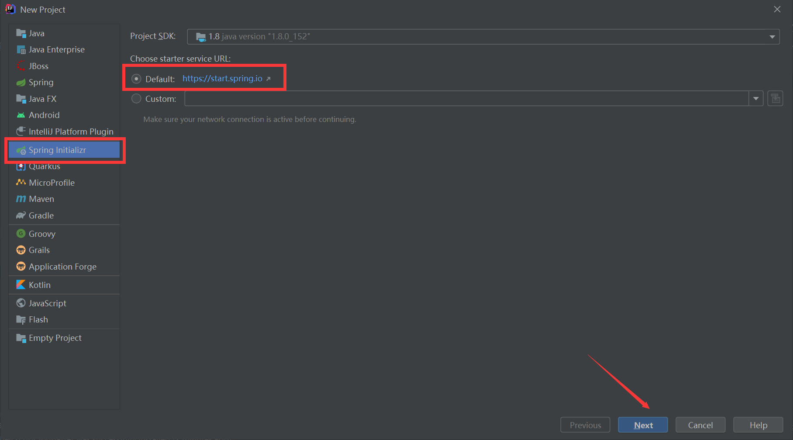
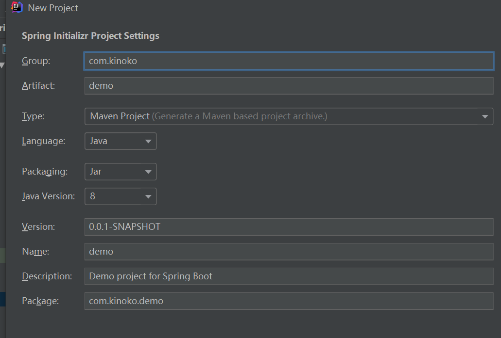
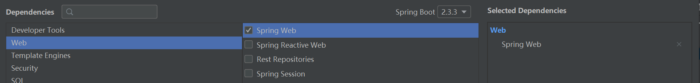
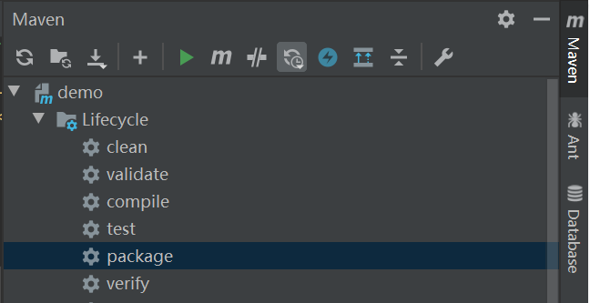
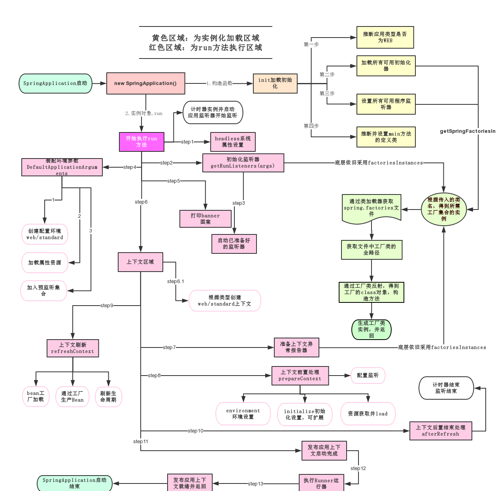
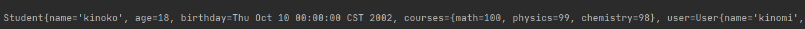
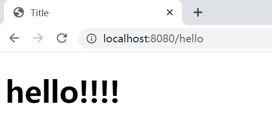
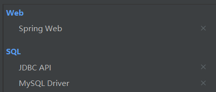
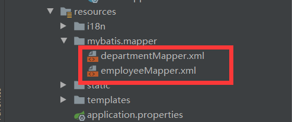

# SpringBoot 学习笔记


### 微服务架构

---

​		微服务是一种架构风格，将应用构建成小的服务的组合，通过http或其它方式互通。

#### 架构演变：

​		随着互联网的发展，网站应用的规模不断扩大，常规的垂直应用架构已无法应对，分布式服务架构以及流动计算架构势在必行，亟需一个治理系统确保架构有条不紊的演进。


**单一应用架构**

​		当网站流量很小时，只需一个应用，将所有功能都部署在一起，以减少部署节点和成本。此时，用于简化增删改查工作量的数据访问框架(ORM)是关键。

**垂直应用架构**

​		当访问量逐渐增大，单一应用增加机器带来的加速度越来越小，提升效率的方法之一是将应用拆成互不相干的几个应用，以提升效率。此时，用于加速前端页面开发的Web框架(MVC)是关键。

**分布式服务架构**

​		当垂直应用越来越多，应用之间交互不可避免，将核心业务抽取出来，作为独立的服务，逐渐形成稳定的服务中心，使前端应用能更快速的响应多变的市场需求。此时，用于提高业务复用及整合的分布式服务框架(RPC)是关键。

**流动计算架构**

​		当服务越来越多，容量的评估，小服务资源的浪费等问题逐渐显现，此时需增加一个调度中心基于访问压力实时管理集群容量，提高集群利用率。此时，用于提高机器利用率的资源调度和治理中心(SOA)是关键。


### 第一个SpringBoot程序

---

#### 开发环境：

- jdk 1.8
- maven 3.6.1
- springboot最新版
- IDEA最新版
- 

#### 创建第一个SpringBoot项目：

idea中集成了官网中的创建网页，这里使用idea创建第一个SpringBoot项目





选择自动导入SpringWeb依赖



可以看到SpringBoot项目本质上是ssm框架中学习过的maven项目

此时搭建一个经典的MVC目录结构，并简单写一个Controller测试运行

**目录结构：**


**打包：**

使用maven中的package进行打包，可在target文件中生成jar包，使用jar包即可运行项目




### SpringBoot原理初探

---

#### 启动器：

```xml
<dependency>
    <groupId>org.springframework.boot</groupId>
    <artifactId>spring-boot-starter-web</artifactId>
</dependency>
```

- 启动器说白了就是SpringBoot的启动场景
- 比如*spring-boot-starter-web*帮我们导入web需要的所有依赖
- springboot会将所有功能场景变成一个个启动器
- 我们要使用什么功能，导入对应的启动器即可


#### 主启动类

```java
package com.kinoko.demo;

import org.springframework.boot.SpringApplication;
import org.springframework.boot.autoconfigure.SpringBootApplication;
//程序主入口
@SpringBootApplication
public class DemoApplication {
    public static void main(String[] args) {
        SpringApplication.run(DemoApplication.class, args);
    }
}
```

@SpringBootApplication: 标注这个类是一个springboot应用，启动类下的所有资源

SpringApplication.run（）启动了一个服务，首先实例化SpringApplication，然后执行run方法

**SpringApplication：**

​	1、推断应用的类型是普通的项目还是Web项目

​	2、查找并加载所有可用初始化器 ， 设置到initializers属性中

​	3、找出所有的应用程序监听器，设置到listeners属性中

​	4、推断并设置main方法的定义类，找到运行的主类

**run方法执行流程：**



[图来源](https://blog.csdn.net/Y_hanxiong/article/details/105207308)


### yaml

---

#### yaml概述

YAML Ain't a Markup Language是一种标记语言,对比传统的xml配置：

```xml
<server>
    <port>8080<port>
</server>
```

```yaml
server: 
	port: 8080
```


#### yaml语法

看一个实例

```yaml
user:
	name: kinoko
	age: 18
	hobbies:
	 - sing
	 - dance
	 - rap
```

语法注意：

- 属性和值的大小写敏感
- 字符串可以直接写，加双引号不会转义特殊字符（如/n），单引号会转义
- 冒号后的空格不能省略


#### 为实体类注入匹配值

回顾在ssm中如何给实体类注入属性值

```java
@Component
public class User {
    @Value("kinoko")
    private String name;
    @Value("18")
    private int age;
}
```

测试一下(别忘了 toString() )

```java
@SpringBootTest
class DemoApplicationTests {
    @Autowired
    User user;
    @Test
    void contextLoads() {
    	system.out.println(user);	//User{name='kinoko', age=18}
    }
}
```


下面，我们**使用yaml配置注入**，首先编写一个复杂一点的pojo（要有构造函数和set方法），包含各种数据类型

```java
@Component
@ConfigurationProperties(prefix = "student")	//下面的配置文件通过这个定位
public class Student {
    private String name;
    private int age;
    private Date birthday;
    private Map<String,Integer> courses;
    private User user;
}
```

对应的创建一个yaml配置文件

注意使用@ConfigurationProperties时idea会提示我们缺少依赖，根据提示添加即可

```yaml
student:
  name: kinoko
  age: 18
  birthday: 2002/10/10
  courses: {math: 100,physics: 99,chemistry: 98}
  user:
    name: kinomi
    age: 3
```

经过测试，注入成功




#### 加载指定的配置文件

@PropertySource可以加载指定位置的配置文件文件

@ConfigurationProperties则从全局配置文件中获取值

```java
@PropertySource(value = "classpath:student.properties")
public class Student {
    @Value("${name}")
    private String name;
    //...
}
```


#### 配置文件占位符

```yaml
student:
  name: kinoko${random.uuid} 	#随机追加uuid
  age: ${random.int}	#随机生成一个int
  birthday: 2002/10/10
  courses: {math: 100,physics: 99,chemistry: 98}
  user:
    name: kinomi
    age: 3
```


### 数据校验

---

在学前端三件套的时候我们知道，对于提交上来的表单数据可以进行简单的校验，例如对姓名，年龄，邮箱等做一个判断，过滤掉其中提交格式不正确的信息

#### 实现方式

Springboot中可以用@validated来校验数据，如果数据异常则会统一抛出异常

```java
@Component
@ConfigurationProperties(prefix = "user")		//配置email为"123456"
@Validated
public class User {

    private String name;

    @Email(message="邮箱格式错误") //name必须是邮箱格式
    private String email;
   //...
}
```


*如果@Email注解报红，说明新版中并没有导入Validation启动器，在pom.xml中导入即可*

```xml
<dependency>
    <groupId>org.springframework.boot</groupId>
    <artifactId>spring-boot-starter-validation</artifactId>
</dependency>
```


#### 常见参数

```java
@NotNull(message="名字不能为空")
private String userName;
@Max(value=120,message="年龄最大不能查过120")
private int age;
@Email(message="邮箱格式错误")
private String email;

//空检查
@Null       //验证对象是否为null
@NotNull    //验证对象是否不为null, 无法查检长度为0的字符串
@NotBlank   //检查约束字符串是不是Null还有被Trim的长度是否大于0,只对字符串,且会去掉前后空格.
@NotEmpty   //检查约束元素是否为NULL或者是EMPTY.
    
//Booelan检查
@AssertTrue     //验证 Boolean 对象是否为 true  
@AssertFalse    //验证 Boolean 对象是否为 false  
    
//长度检查
@Size(min=, max=) //验证对象（Array,Collection,Map,String）长度是否在给定的范围之内  
@Length(min=, max=) //string is between min and max included.

//日期检查
@Past       //验证 Date 和 Calendar 对象是否在当前时间之前  
@Future     //验证 Date 和 Calendar 对象是否在当前时间之后  
@Pattern    //验证 String 对象是否符合正则表达式的规则

//.......
```


### SpringBoot Web开发

---

Web开发中，我们需要解决几个问题：

- 导入静态资源
- 建立首页
- 模板引擎
- 装配扩展SpringMVC
- 数据库操作
- 拦截器


#### 导入静态资源

当我们使用ssm框架开发时，我们可访问到的资源可以放在WEB-INF目录下。那么在SpringBoot项目中，静态资源放置位置又在哪里呢？

看以下SpringBoot源码片段

```java
@Override
public void addResourceHandlers(ResourceHandlerRegistry registry) {
    if (!this.resourceProperties.isAddMappings()) {
        // 已禁用默认资源处理
        logger.debug("Default resource handling disabled");
        return;
    }
    // 缓存控制
    Duration cachePeriod = this.resourceProperties.getCache().getPeriod();
    CacheControl cacheControl = this.resourceProperties.getCache().getCachecontrol().toHttpCacheControl();
    // webjars 配置
    if (!registry.hasMappingForPattern("/webjars/**")) {
        customizeResourceHandlerRegistration(registry.addResourceHandler("/webjars/**")
                                             .addResourceLocations("classpath:/META-INF/resources/webjars/")
                                             .setCachePeriod(getSeconds(cachePeriod)).setCacheControl(cacheControl));
    }
    // 静态资源配置
    String staticPathPattern = this.mvcProperties.getStaticPathPattern();
    if (!registry.hasMappingForPattern(staticPathPattern)) {
        customizeResourceHandlerRegistration(registry.addResourceHandler(staticPathPattern)
                                             .addResourceLocations(getResourceLocations(this.resourceProperties.getStaticLocations()))
                                             .setCachePeriod(getSeconds(cachePeriod)).setCacheControl(cacheControl));
    }
}
```

```java

// 进入方法
public String[] getStaticLocations() {
    return this.staticLocations;
}
// 找到对应的值
private String[] staticLocations = CLASSPATH_RESOURCE_LOCATIONS;
// 找到路径
private static final String[] CLASSPATH_RESOURCE_LOCATIONS = { 
    "classpath:/META-INF/resources/",
  "classpath:/resources/", 
    "classpath:/static/", 
    "classpath:/public/" 
};
```

 classpath:/META-INF/resources/webjars/ 下对应的资源可以使用/webjars/**访问到

以下四个目录存放的静态资源可以被我们识别，我们可以在resources根目录下新建对应的文件夹，都可以存放我们的静态文件,通过/**就可访问到

优先级 resources > static(默认) > public

```java
"classpath:/META-INF/resources/"
"classpath:/resources/"
"classpath:/static/"
"classpath:/public/"
```


#### 定制首页

查看源码，找到一个welcomePageHandlerMapping方法

```java
@Bean
public WelcomePageHandlerMapping welcomePageHandlerMapping(ApplicationContext applicationContext,
                                                           FormattingConversionService mvcConversionService,
                                                           ResourceUrlProvider mvcResourceUrlProvider) {
    WelcomePageHandlerMapping welcomePageHandlerMapping = new WelcomePageHandlerMapping(
        new TemplateAvailabilityProviders(applicationContext), applicationContext, getWelcomePage(), // getWelcomePage 获得欢迎页
        this.mvcProperties.getStaticPathPattern());
    welcomePageHandlerMapping.setInterceptors(getInterceptors(mvcConversionService, mvcResourceUrlProvider));
    return welcomePageHandlerMapping;
}
```

```java

private Optional<Resource> getWelcomePage() {
    String[] locations = getResourceLocations(this.resourceProperties.getStaticLocations());
    // ::是java8 中新引入的运算符
    // Class::function的时候function是属于Class的，应该是静态方法。
    // this::function的funtion是属于这个对象的。
    // 简而言之，就是一种语法而已，是一种简写
    return Arrays.stream(locations).map(this::getIndexHtml).filter(this::isReadable).findFirst();
}
// 欢迎页就是一个location下的的 index.html 而已
private Resource getIndexHtml(String location) {
    return this.resourceLoader.getResource(location + "index.html");
}
```

可以发现首页默认为静态资源文件夹下的所有 index.html 页面；被 / 映射。

在templates目录下的页面只能通过controller跳转


#### Thymeleaf模板引擎

**模板引擎：**

在ssm框架中，我们使用jsp页面来实现数据的显示和交互，但SpringBoot目前默认不支持jsp。那么SpringBoot如何写动态页面呢？SpringBoot给我们推荐Thymeleaf模板引擎，它是一个高级语言的模板引擎，他的这个语法更简单。而且呢，功能更强大。（jsp也是一个模板引擎）

**引入Thymeleaf:**

- Thymeleaf 官网：https://www.thymeleaf.org/
- Thymeleaf 在Github 的主页：https://github.com/thymeleaf/thymeleaf
- Spring官方文档：https://docs.spring.io/spring-boot/docs/2.2.5.RELEASE/reference/htmlsingle/#using-boot-starter 

在pom.xml中添加启动器

```xml
<!--thymeleaf-->
<dependency>
    <groupId>org.springframework.boot</groupId>
    <artifactId>spring-boot-starter-thymeleaf</artifactId>
</dependency>
```

**测试：**

Thymeleaf的自动配置类：ThymeleafProperties

```java

@ConfigurationProperties(
    prefix = "spring.thymeleaf"
)
public class ThymeleafProperties {
    private static final Charset DEFAULT_ENCODING;
    public static final String DEFAULT_PREFIX = "classpath:/templates/";
    public static final String DEFAULT_SUFFIX = ".html";
    private boolean checkTemplate = true;
    private boolean checkTemplateLocation = true;
    private String prefix = "classpath:/templates/";
    private String suffix = ".html";
    private String mode = "HTML";
    private Charset encoding;
}
```

我们只需要把我们的html页面放在类路径下的templates下，thymeleaf就可以帮我们自动渲染了.我们写一个controller

```java
@Controller
public class HelloController {
    @RequestMapping("/hello")
    public String hello(){
        return "test";
    }
}
```

同时我们在template目录下建立一个test.html，启动，请求成功跳转



#### thymeleaf语法

Thymeleaf 官网：https://www.thymeleaf.org/

这部分可以参考官方文档学习，用到什么查什么，用多了就熟悉了

```java
//案例
@RequestMapping("/hello")
public String test2(Map<String,Object> map){
    //存入数据
    map.put("msg","<h1>Hello</h1>");
    map.put("users", Arrays.asList("zhangsan","lisi"));
    return "test";
}
```

```html
<!--案例-->
<!DOCTYPE html>
<html lang="en" xmlns:th="http://www.thymeleaf.org">
<head>
    <meta charset="UTF-8">
    <title>title</title>
</head>
<body>

<div th:text="${msg}"></div>
<!--不转义-->
<div th:utext="${msg}"></div>

<!--遍历数据-->
<!--th:each每次遍历都会生成当前这个标签：官网#9-->
<h4 th:each="user :${users}" th:text="${user}"></h4>

<h4>
    <!--行内写法：官网#12-->
    <span th:each="user:${users}">[[${user}]]</span>
</h4>

</body>
</html>
```


#### 扩展SpringMVC

先看官方文档

> If you want to keep Spring Boot MVC features and you want to add additional MVC configuration (interceptors, formatters, view controllers, and other features), you can add your own @Configuration class of type WebMvcConfigurer but without @EnableWebMvc. If you wish to provide custom instances of RequestMappingHandlerMapping, RequestMappingHandlerAdapter, or ExceptionHandlerExceptionResolver, you can declare a WebMvcRegistrationsAdapter instance to provide such components.


例如，要自定义一个视图解析器

```java
@Configuration  //按照文档要求添加注解
//实现WebMvcConfigurer接口，此类已经变成一个配置类
public class MyConfig implements WebMvcConfigurer {
    
    @Bean
    public ViewResolver myViewResolver(){
        return new MyViewResolver();
    }

    //定义自己的视图解析器，其它组件可以参考文档
    private static class MyViewResolver implements ViewResolver{
        @Override
        public View resolveViewName(String s, Locale locale) throws Exception {
            return null;
        }
    }
}
```

​		可以得出结论，当我们需要diy自己的一些功能组件时，我们可以按照文档要求书写组件，将组件丢给SpringBoot，SpringBoot可以自动装配扫描选择应用


### 操作数据库

#### 整合JDBC

**数据源测试：**

创建项目，引入jdbc模块和MySQL驱动



发现idea帮我们自动导入了jdbc启动器和mysql依赖

```xml
<dependency>
    <groupId>org.springframework.boot</groupId>
    <artifactId>spring-boot-starter-jdbc</artifactId>
</dependency>
<dependency>
    <groupId>mysql</groupId>
    <artifactId>mysql-connector-java</artifactId>
    <scope>runtime</scope>
</dependency>
```

编写链接数据库的配置文件,springboot会根据此配置文件帮我们自动配置

```yaml
spring:
  datasource:
    username: root
    password: 123456
    url: jdbc:mysql://localhost:3306/springboot?useUnicode=true&characterEncoding=utf-8
    driver-class-name: com.mysql.cj.jdbc.Driver
```

测试一下,拿到了connection，我们就可以使用jdbc的操作来操作数据库了

```java

@SpringBootTest
class SpringbootDataJdbcApplicationTests {

    //DI注入数据源
    @Autowired
    DataSource dataSource;

    @Test
    public void contextLoads() throws SQLException {
        //看一下默认数据源
        System.out.println(dataSource.getClass());
        //获得连接
        Connection connection =   dataSource.getConnection();
        System.out.println(connection);
        //关闭连接
        connection.close();
    }
}
```

**JDBC Template**:

spring 对jdbc做了轻量级的封装，就是jdbc template，它主要提供以下几类方法

- execute方法：可以用于执行任何SQL语句，一般用于执行DDL语句；
- update方法及batchUpdate方法：update方法用于执行新增、修改、删除等语句；batchUpdate方法用于执行批处理相关语句；
- query方法及queryForXXX方法：用于执行查询相关语句；
- call方法：用于执行存储过程、函数相关语句。

```java
//Controller示例


@RestController
@RequestMapping("/jdbc")
public class JdbcController {

    @Autowired
    JdbcTemplate jdbcTemplate;

    //查询employee表中所有数据
    //List 中的1个 Map 对应数据库的 1行数据
    //Map 中的 key 对应数据库的字段名，value 对应数据库的字段值
    @GetMapping("/list")
    public List<Map<String, Object>> userList(){
        String sql = "select * from employee";
        List<Map<String, Object>> maps = jdbcTemplate.queryForList(sql);
        return maps;
    }
    
    //新增一个用户
    @GetMapping("/add")
    public String addUser(){
        //插入语句，注意时间问题
        String sql = "insert into employee(last_name, email,gender,department,birth)" +
                " values ('kinoko','y761016990@126.com',1,101,'"+ new Date().toLocaleString() +"')";
        jdbcTemplate.update(sql);
        //查询
        return "addOk";
    }

    //修改用户信息
    @GetMapping("/update/{id}")
    public String updateUser(@PathVariable("id") int id){
        //插入语句
        String sql = "update employee set last_name=?,email=? where id="+id;
        //数据
        Object[] objects = new Object[2];
        objects[0] = "kinoko";
        objects[1] = "kinomi@stu.pku.edu.cn";
        jdbcTemplate.update(sql,objects);
        //查询
        return "updateOk";
    }

    //删除用户
    @GetMapping("/delete/{id}")
    public String delUser(@PathVariable("id") int id){
        //插入语句
        String sql = "delete from employee where id=?";
        jdbcTemplate.update(sql,id);
        //查询
        return "deleteOk";
    }
    
}
```


#### 整合Mybatis

*官方文档：http://mybatis.org/spring-boot-starter/mybatis-spring-boot-autoconfigure/*

1、导入所需依赖

```xml
<dependency>
    <groupId>org.mybatis.spring.boot</groupId>
    <artifactId>mybatis-spring-boot-starter</artifactId>
    <version>2.1.1</version>
</dependency>
```

2、在配置文件(application.properties或yaml)中配置数据库连接

```properties
spring.datasource.username=root
spring.datasource.password=123456
spring.datasource.url=jdbc:mysql://localhost:3306/manager?serverTimezone=UTC&useUnicode=true&characterEncoding=utf-8
spring.datasource.driver-class-name=com.mysql.cj.jdbc.Driver
```

3、创建实体类，创建mapper接口，创建service层调用mapper，项目结构如图


mapper接口需要添加注解@Mapper表示这是mybatis的mapper接口

```java
package com.kinoko.Mapper;

import com.kinoko.pojo.Employee;
import org.apache.ibatis.annotations.Mapper;
import org.springframework.stereotype.Repository;

import java.util.List;

@Mapper		//表示这是mybatis的mapper接口
@Repository

public interface EmployeeMapper {

    List<Employee> selectAllEmployees();
    Employee selectEmployeeById(int id);
    int addEmployee(Employee employee);
    int updateEmployee(Employee employee);
    int deleteEmployee(int id);

}
```

4、创建mapper的xml映射文件书写sql，这里我们将文件创建在resources的mapper文件夹下，对应的application配置文件中需要配置此路径，也可相应的配置别名操作



```properties
mybatis.type-aliases-package=com.kinoko.pojo
mybatis.mapper-locations=classpath:mybatis/mapper/*.xml
```

```xml
<?xml version="1.0" encoding="UTF-8" ?>
<!DOCTYPE mapper
        PUBLIC "-//mybatis.org//DTD Mapper 3.0//EN"
        "http://mybatis.org/dtd/mybatis-3-mapper.dtd">
<mapper namespace="com.kinoko.Mapper.EmployeeMapper">
    <!--顺便复习一下一对多、多对一等-->
    <select id="selectAllEmployees" resultMap="employeeMap">
        select * from manager.employee;
    </select>

    <select id="selectEmployeeById" resultMap="employeeMap">
        select * from manager.employee where id = #{id};
    </select>

    <insert id="addEmployee" parameterType="employee">
        insert into manager.employee (id,lastName,email,gender,department,birth)
        values(#{id},#{lastName},#{email},#{gender},#{department.id},#{birth})
    </insert>

    <update id="updateEmployee" parameterType="employee">
        update manager.employee set
        lastName = #{lastName},
        email = #{email},
        gender = #{gender},
        department = #{department.id},
        birth = #{birth}
        where id = #{id};
    </update>

    <delete id="deleteEmployee">
        delete from manager.employee where id = #{id};
    </delete>

    <select id="getDepartment" resultType="Department">
        select * from manager.department where id = #{department};
    </select>

    <resultMap id="employeeMap" type="Employee">
        <result property="id" column="id"/>
        <result property="lastName" column="lastName"/>
        <result property="email" column="email"/>
        <result property="gender" column="gender"/>
        <result property="birth" column="birth"/>
        <association property="department" javaType="Department"
                     column="department" select="getDepartment"/>
    </resultMap>
</mapper>
```

5、完成，在controller层同样调用service层接口实现CRUD

